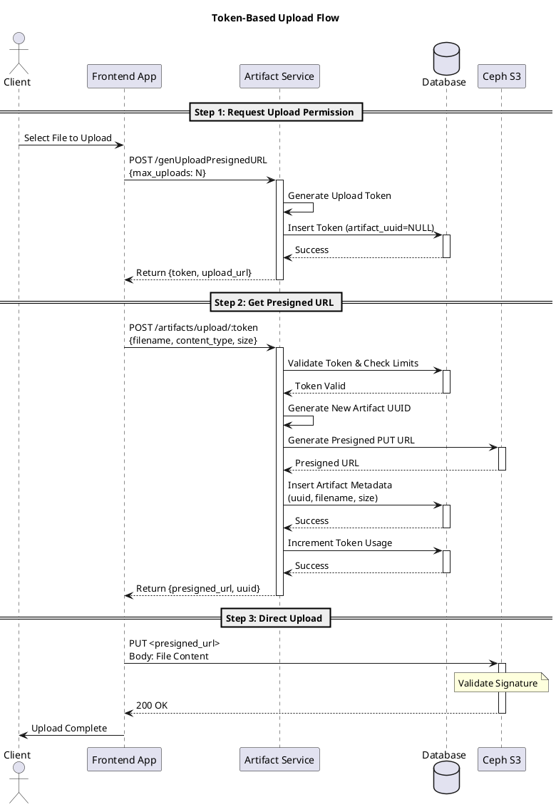
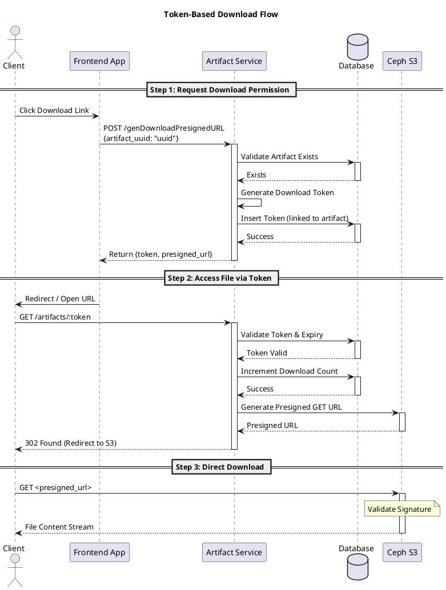

# Token-Based Upload & Download Sequence Diagrams

## 1. Upload Flow (UploadByToken)

```plantuml
@startuml
title Token-Based Upload Flow

actor Client
participant "Frontend App" as Frontend
participant "Artifact Service" as API
database "Database" as DB
participant "Ceph S3" as S3

== Step 1: Request Upload Permission ==
Client -> Frontend: Select File to Upload
Frontend -> API: POST /genUploadPresignedURL\n{max_uploads: N}
activate API
API -> API: Generate Upload Token
API -> DB: Insert Token (artifact_uuid=NULL)
activate DB
DB --> API: Success
deactivate DB
API --> Frontend: Return {token, upload_url}
deactivate API

== Step 2: Get Presigned URL ==
Frontend -> API: POST /artifacts/upload/:token\n{filename, content_type, size}
activate API
API -> DB: Validate Token & Check Limits
activate DB
DB --> API: Token Valid
deactivate DB
API -> API: Generate New Artifact UUID
API -> S3: Generate Presigned PUT URL
activate S3
S3 --> API: Presigned URL
deactivate S3
API -> DB: Insert Artifact Metadata\n(uuid, filename, size)
activate DB
DB --> API: Success
deactivate DB
API -> DB: Increment Token Usage
activate DB
DB --> API: Success
deactivate DB
API --> Frontend: Return {presigned_url, uuid}
deactivate API

== Step 3: Direct Upload ==
Frontend -> S3: PUT <presigned_url>\nBody: File Content
activate S3
note over S3: Validate Signature
S3 --> Frontend: 200 OK
deactivate S3
Frontend -> Client: Upload Complete

@enduml
```

## 2. Download Flow (DownloadByToken)

```plantuml
@startuml
title Token-Based Download Flow

actor Client
participant "Frontend App" as Frontend
participant "Artifact Service" as API
database "Database" as DB
participant "Ceph S3" as S3

== Step 1: Request Download Permission ==
Client -> Frontend: Click Download Link
Frontend -> API: POST /genDownloadPresignedURL\n{artifact_uuid: "uuid"}
activate API
API -> DB: Validate Artifact Exists
activate DB
DB --> API: Exists
deactivate DB
API -> API: Generate Download Token
API -> DB: Insert Token (linked to artifact)
activate DB
DB --> API: Success
deactivate DB
API --> Frontend: Return {token, presigned_url}
deactivate API

== Step 2: Access File via Token ==
Frontend -> Client: Redirect / Open URL
Client -> API: GET /artifacts/:token
activate API
API -> DB: Validate Token & Expiry
activate DB
DB --> API: Token Valid
deactivate DB
API -> DB: Increment Download Count
activate DB
DB --> API: Success
deactivate DB
API -> S3: Generate Presigned GET URL
activate S3
S3 --> API: Presigned URL
deactivate S3
API --> Client: 302 Found (Redirect to S3)
deactivate API

== Step 3: Direct Download ==
Client -> S3: GET <presigned_url>
activate S3
note over S3: Validate Signature
S3 --> Client: File Content Stream
deactivate S3

@enduml
```