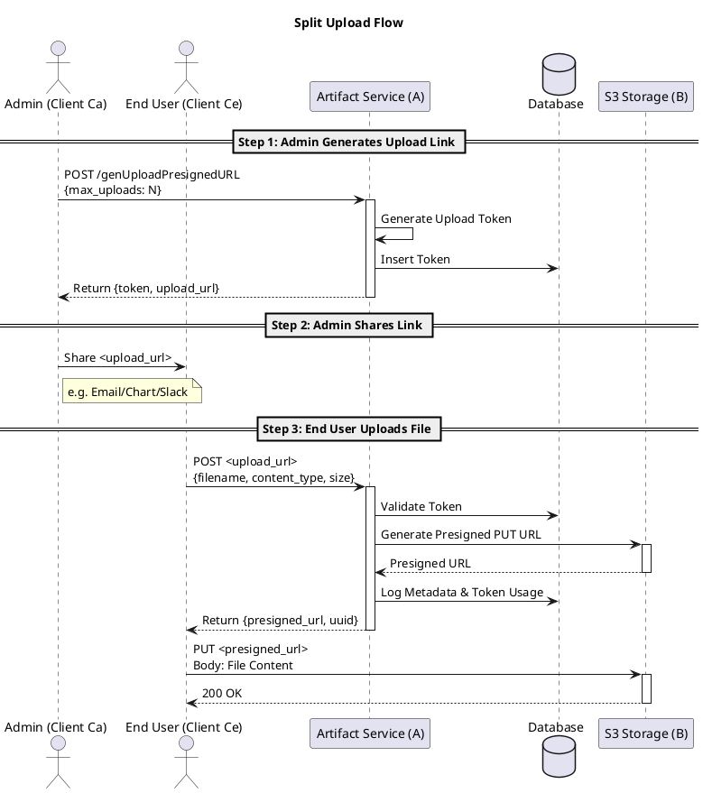
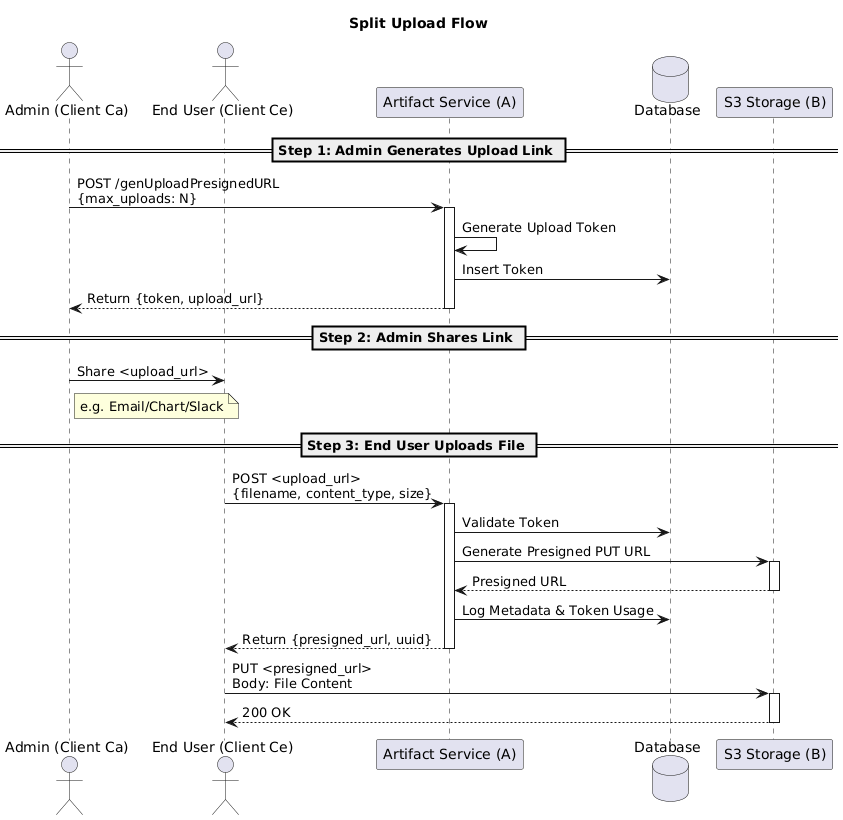
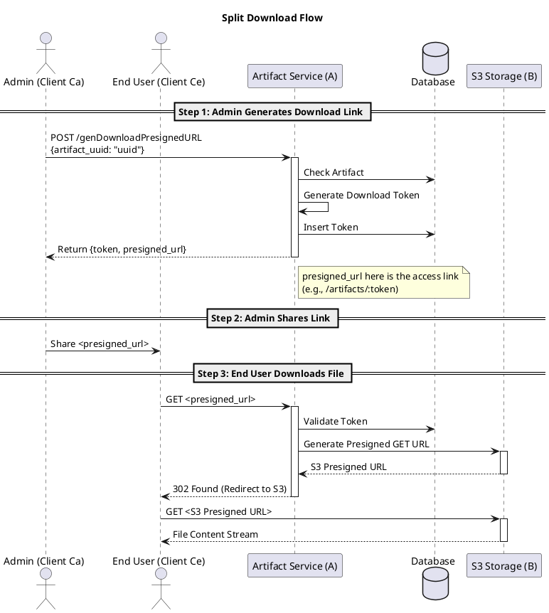
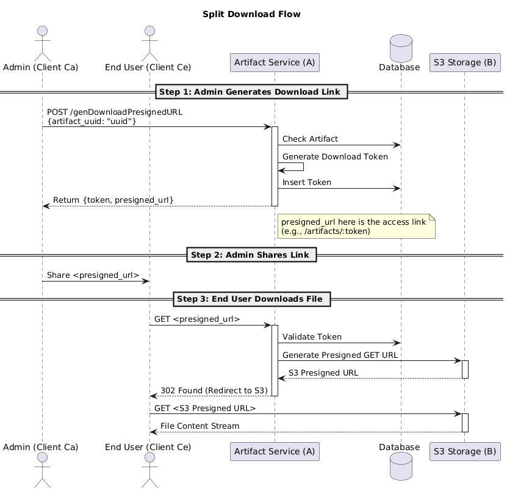

# Split Admin/User Flow Sequence Diagrams

## 1. Split Upload Flow (Admin Generates, User Uploads)

```plantuml
@startuml
title Split Upload Flow

actor "Admin (Client Ca)" as Admin
actor "End User (Client Ce)" as User
participant "Artifact Service (A)" as API
database "Database" as DB
participant "S3 Storage (B)" as S3

== Step 1: Admin Generates Upload Link ==
Admin -> API: POST /genUploadPresignedURL\n{max_uploads: N}
activate API
API -> API: Generate Upload Token
API -> DB: Insert Token
API --> Admin: Return {token, upload_url}
deactivate API

== Step 2: Admin Shares Link ==
Admin -> User: Share <upload_url>
note right of Admin: e.g. Email/Chart/Slack

== Step 3: End User Uploads File ==
User -> API: POST <upload_url>\n{filename, content_type, size}
activate API
API -> DB: Validate Token
API -> S3: Generate Presigned PUT URL
activate S3
S3 --> API: Presigned URL
deactivate S3
API -> DB: Log Metadata & Token Usage
API --> User: Return {presigned_url, uuid}
deactivate API

User -> S3: PUT <presigned_url>\nBody: File Content
activate S3
S3 --> User: 200 OK
deactivate S3

@enduml
```

## 2. Split Download Flow (Admin Generates, User Downloads)

```plantuml
@startuml
title Split Download Flow

actor "Admin (Client Ca)" as Admin
actor "End User (Client Ce)" as User
participant "Artifact Service (A)" as API
database "Database" as DB
participant "S3 Storage (B)" as S3

== Step 1: Admin Generates Download Link ==
Admin -> API: POST /genDownloadPresignedURL\n{artifact_uuid: "uuid"}
activate API
API -> DB: Check Artifact
API -> API: Generate Download Token
API -> DB: Insert Token
API --> Admin: Return {token, presigned_url}
deactivate API
note right of API: presigned_url here is the access link\n(e.g., /artifacts/:token)

== Step 2: Admin Shares Link ==
Admin -> User: Share <presigned_url>

== Step 3: End User Downloads File ==
User -> API: GET <presigned_url>
activate API
API -> DB: Validate Token
API -> S3: Generate Presigned GET URL
activate S3
S3 --> API: S3 Presigned URL
deactivate S3
API --> User: 302 Found (Redirect to S3)
deactivate API

User -> S3: GET <S3 Presigned URL>
activate S3
S3 --> User: File Content Stream
deactivate S3

@enduml
```

